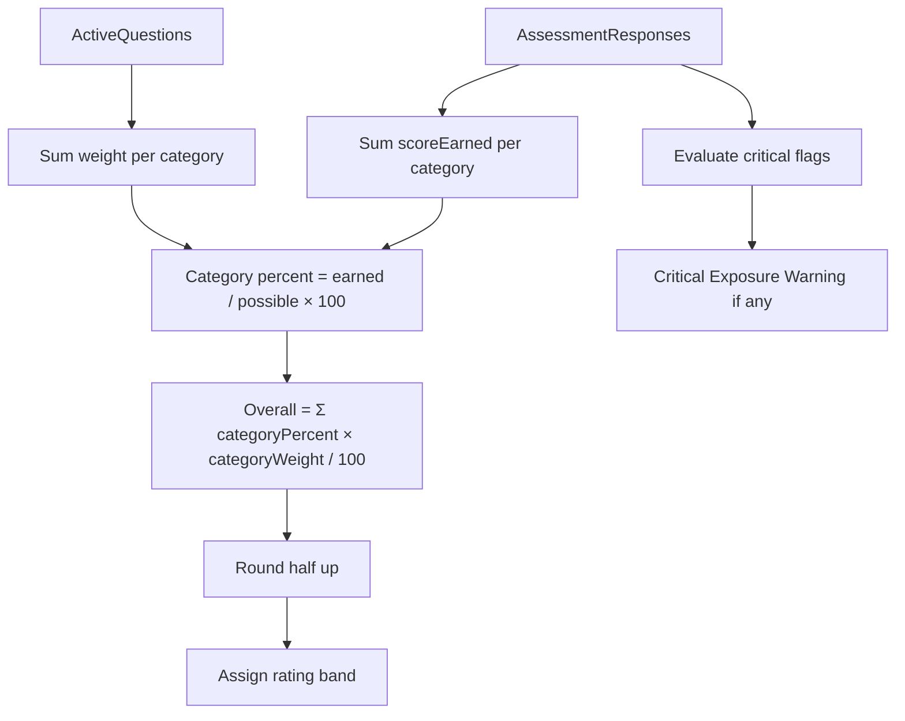

> **Migration notice (Stage A):** This document is **Appendix A – v1 Implementation Reference** under [DOC-111 – Scoring Engine Specification](DOC-111%20%E2%80%93%20Scoring%20Engine%20Specification.md). It remains **implementation-active** for the running application until Phase 5 cutover (target: TBD). **DOC-111** is the long-term authoritative scoring specification.

# Appendix A – v1 Scoring Implementation (Active for Running Application)

## Purpose

This document is the **v1 implementation** scoring specification for BobKat StackScore. It supersedes conflicting sections in [DOC-111B – Scoring Methodology Reference](DOC-111B%20-%20Scoring%20Engine%20Specification.md) where noted.

**Related documents:** [DOC-115 – Question Scoring Matrix (v1 Legacy)](DOC-115%20-%20Question%20Scoring%20Matrix.md), [DOC-301 – Database Schema Specification](DOC-301%20%E2%80%93%20Database%20Schema%20Specification.md), [DOC-118 – v1 to v2 Compatibility Reference](DOC-118%20%E2%80%93%20v1%20to%20v2%20Compatibility%20Reference.md), [RecommendationRuleCatalog.json](RecommendationRuleCatalog.json)

---

## Design Decisions (Resolved)

| Topic | Decision |
| ----- | -------- |
| Risk multiplier vs. critical flags | **Critical flags only** — no score penalties beyond answer point values |
| Category score storage | **Percent (0–100)** on denormalized `Assessments` columns; canonical detail in `Assessment Category Scores` |
| Overall score rounding | **Round half up** to nearest integer (74.75 → 75) |
| Projected score cap | **Hard cap at 100** |
| Unanswered questions (draft) | Excluded from calculation; completion requires all active questions answered |
| Source of truth for category breakdown | `Assessment Category Scores` table |

---

## Scoring Model Overview



---

## Question-Level Scoring

Each question has a **weight** (maximum points) defined in [DOC-115 – Question Scoring Matrix](DOC-115%20-%20Question%20Scoring%20Matrix.md).

Each answer option has a **scoreValue** between 0 and the question weight.

When an assessor selects an answer:

```text
response.scoreEarned = answerOption.scoreValue
```

---

## Category Score Calculation

For each category in an assessment:

```text
pointsEarned   = SUM(response.scoreEarned) for all answered questions in category
pointsPossible = SUM(question.weight) for all active questions in category
percentScore   = (pointsEarned / pointsPossible) × 100
```

### Category rating

Category ratings use the same bands as overall score, applied to `percentScore`:

| percentScore | Rating |
| -----------: | ------ |
| 90–100 | exceptional |
| 80–89 | strong |
| 70–79 | stable |
| 60–69 | at_risk |
| Below 60 | critical |

### Storage

**`Assessment Category Scores` (canonical):**

| Field | Value |
| ----- | ----- |
| pointsEarned | Raw earned points |
| pointsPossible | Raw possible points |
| percentScore | Category percentage (2 decimal places) |
| rating | Enum from table above |

**`Assessments` (denormalized for queries):**

| Field | Value |
| ----- | ----- |
| securityScore | Security category percentScore |
| backupScore | Backup category percentScore |
| infrastructureScore | Infrastructure category percentScore |
| endpointScore | Endpoint category percentScore |
| documentationScore | Documentation category percentScore |
| bcdrScore | BCDR category percentScore |
| strategicScore | Strategic category percentScore |

Denormalized values are written in the same transaction when an assessment is completed. They must always match `Assessment Category Scores`.

---

## Overall StackScore Calculation

Each category has a **weight** equal to its maximum points (summing to 100).

```text
overallScore = ROUND_HALF_UP(
  (securityPercent     × 20 / 100) +
  (backupPercent       × 20 / 100) +
  (infrastructurePercent × 15 / 100) +
  (endpointPercent     × 15 / 100) +
  (documentationPercent × 10 / 100) +
  (bcdrPercent         × 10 / 100) +
  (strategicPercent    × 10 / 100)
)
```

### Equivalent formula

```text
overallScore = ROUND_HALF_UP(
  (securityEarned / securityPossible) × 20 +
  (backupEarned / backupPossible) × 20 +
  ... etc
)
```

Both formulas produce identical results.

### Worked example

| Category | Earned | Possible | Percent | Weighted contribution |
| -------- | -----: | -------: | ------: | --------------------: |
| Security | 16 | 20 | 80.00 | 16.00 |
| Backup | 14 | 20 | 70.00 | 14.00 |
| Infrastructure | 13.5 | 15 | 90.00 | 13.50 |
| Endpoint | 12.75 | 15 | 85.00 | 12.75 |
| Documentation | 6 | 10 | 60.00 | 6.00 |
| BCDR | 5 | 10 | 50.00 | 5.00 |
| Strategic | 7.5 | 10 | 75.00 | 7.50 |
| **Total** | | | | **74.75 → 75** |

**Overall rating:** stable (70–79)

---

## Overall Rating Bands

| overallScore | Rating | Display label |
| -----------: | ------ | ------------- |
| 90–100 | exceptional | Exceptional |
| 80–89 | strong | Strong |
| 70–79 | stable | Stable |
| 60–69 | at_risk | At Risk |
| Below 60 | critical | Critical |

---

## Critical Exposure Warning (Replaces Risk Multiplier)

The **Risk Multiplier Logic** described in [DOC-111B – Scoring Methodology Reference](DOC-111B%20-%20Scoring%20Methodology%20Reference.md) is **deprecated**. StackScore v1 uses **critical flags only**:

- Worst-tier answers do **not** apply additional score penalties beyond `scoreValue = 0`.
- Specific answers set `triggersCriticalFlag = true` (see [DOC-115 – Question Scoring Matrix](DOC-115%20-%20Question%20Scoring%20Matrix.md)).
- When any critical flag is present on a **completed** assessment, the report displays:

  > **Critical Exposure Warning** — This environment has critical security or recovery gaps despite the overall score.

The overall score and rating are **not modified**. The warning is a separate boolean: `hasCriticalExposure`.

### Critical flag triggers (v1)

| Question | Condition |
| -------- | --------- |
| Q01 — MFA for M365 users | Answer = No |
| Q03 — Endpoint protection installed | Answer = No |
| Q11 — Server backups | Answer = No |
| Q13 — M365 backup | Answer = No |
| Q17 — Ransomware backup protection | Answer = No |
| Q19 — Firewall age | Answer = More than 8 Years |
| Q31 — Unsupported OS | Answer = Many |

---

## Draft Assessment Scoring

| Status | Scoring behavior |
| ------ | ---------------- |
| draft | Scores may be computed for preview but are not persisted to `Client Score History` |
| completed | Full calculation runs; all scores persisted; recommendations generated |
| archived | Scores frozen; no recalculation |

### Completion requirements

1. All active questions must have a response.
2. Assessor user must be assigned.
3. Assessment date must be set.

### Unanswered questions

Unanswered questions are excluded from `pointsPossible` during draft preview only. **Completion is blocked** until every active question is answered.

---

## Projected Score Calculation

Projected score estimates improvement if open recommendations are implemented.

### Rules

1. Start from current `overallScore`.
2. Collect `estimatedImpactPoints` from **open** recommendations linked to the assessment.
3. Apply **consolidation groups** first (see [RecommendationRuleCatalog.json](RecommendationRuleCatalog.json)) — use consolidated impact, not sum of individuals.
4. For non-consolidated recommendations, sum impacts but **deduplicate by category** — only the highest-impact recommendation per category counts toward projection (prevents double-counting).
5. Add total impact to current score.
6. **Cap at 100.**

```text
projectedScore = MIN(100, overallScore + consolidatedImpactTotal)
```

### Worked example

| Current score | Open recommendations (after dedup) | Projected |
| ------------- | ---------------------------------: | --------: |
| 63 | MFA +8, Endpoint +6, M365 Backup +8 (Backup category max) | 85 |

Note: Three recommendations totaling +24 raw points yield +22 after category deduplication within Backup (M365 backup is highest in that category overlap scenario). Implementation uses per-category max as defined in recommendation catalog.

### actualImpactPoints (Projects)

Measured only by **re-assessment**, not estimated at project completion:

```text
actualImpactPoints = newOverallScore - priorOverallScore (for the relevant category or overall, stored on project)
```

Projects do not auto-update scores. Completing a project marks the recommendation `completed` and prompts scheduling a follow-up assessment.

---

## Client Score History

A `Client Score History` record is created when an assessment transitions to `completed`:

| Field | Source |
| ----- | ------ |
| overallScore | Assessments.overallScore |
| Category scores | Assessments denormalized columns |
| recordedDate | Assessments.completedAt |
| assessmentId | Assessments.id |

Manual score adjustments are **not supported** in v1.

---

## Executive Summary Generation

On assessment completion, the system auto-generates a draft `executiveSummary` containing:

1. **Overall score and rating** — e.g., "75 / 100 — Stable"
2. **Critical exposure warning** — if `hasCriticalExposure`
3. **Top strengths** — up to 2 highest `percentScore` categories
4. **Top risks** — up to 2 lowest `percentScore` categories
5. **Recommended next actions** — up to 5 highest-priority open recommendations
6. **Projected score** — if open recommendations exist

Assessors may edit `executiveSummary` before finalizing. `internalNotes` are never included in client-facing output.

---

## Recalculation Policy

| Event | Recalculate? |
| ----- | ------------ |
| Response changed on draft | Yes (preview) |
| Response changed on completed | No — create new assessment |
| Question deactivated after completion | No — historical scores unchanged |
| Question weight changed in seed data | Only affects new assessments |

---

## Implementation Checklist

- [ ] Seed questions and answer options from [DOC-115 – Question Scoring Matrix](DOC-115%20-%20Question%20Scoring%20Matrix.md)
- [ ] Score engine reads weights and scoreValues from database
- [ ] Write `Assessment Category Scores` then denormalize to `Assessments` in one transaction
- [ ] Set `hasCriticalExposure` on assessment completion
- [ ] Projected score uses consolidation and category deduplication rules
- [ ] Round overall score with half-up rule

---

## Deprecation Notice for DOC-111B – Scoring Methodology Reference

The following sections of [DOC-111B – Scoring Methodology Reference](DOC-111B%20-%20Scoring%20Methodology%20Reference.md) are superseded by this document:

- **Risk Multiplier Logic** — replaced by Critical Exposure Warning
- Ambiguous storage format — clarified above
- Unbounded projected score examples — capped at 100 with deduplication rules

All other sections of DOC-111B – Scoring Methodology Reference remain valid reference material for business context and examples.
