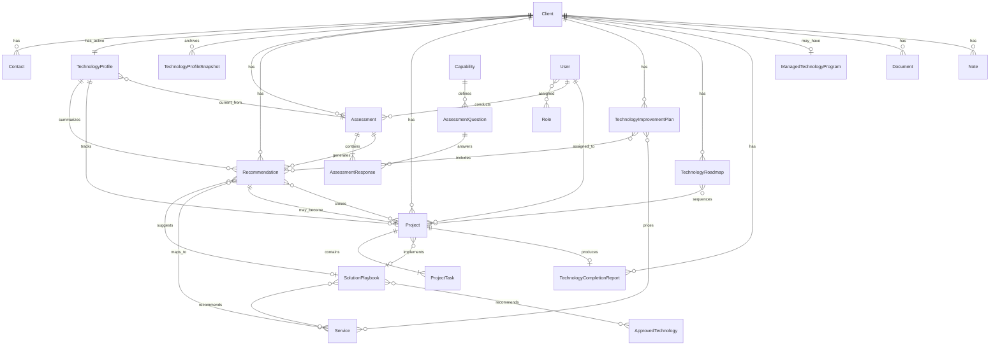

# DOC-120 – Domain Model Specification

**Document ID:** DOC-120
**Version:** 1.1
**Status:** Draft
**Owner:** BobKat IT
**Last Updated:** July 4, 2026

---

# 1. Purpose

DOC-120 defines the core business objects, ownership model, relationships, lifecycle rules, and domain boundaries for StackScore.

This document translates the existing business architecture into a software domain model that can later guide Prisma schema design, API design, service layer design, and application workflows.

DOC-120 is a **business and domain specification**. It is not a database schema, API contract, or implementation guide.

---

# 2. Domain Philosophy

StackScore is organized around **continuous technology improvement** for each client.

* The **Client** is the root aggregate — all operational data belongs to exactly one client.
* The **Technology Profile** is the primary client-facing business object — it represents the current state of the client's technology environment.
* **Assessments** capture point-in-time evidence; once completed, they do not change.
* **Projects** represent approved business initiatives; completed projects remain permanent evidence of improvement.
* **Catalog objects** (services, technologies, playbooks) are shared reference data — they are not owned by individual clients.
* **Planning artifacts** (Technology Improvement Plan, Technology Roadmap) are client-scoped and evolve over time.
* The Technology Profile changes only through **reassessment** or **verified qualifying work** — never through manual score editing.

---

# 3. Root Object

## Client

The **Client** is the root object in the StackScore domain.

Every other client-scoped entity — Technology Profile, assessments, recommendations, projects, documents, notes, and planning artifacts — is owned by exactly one Client.

Deleting a Client is not a normal business operation. Client records support long-term Technology Journey history.

---

# 4. Primary Object

## Technology Profile

The **Technology Profile** is the primary object associated with a Client.

It aggregates:

* Current StackScore and category scores
* Technology maturity level
* Risk summary
* Active and completed improvement history
* Links to current recommendations, projects, roadmap, and managed services

**Rule:** Every client maintains exactly **one active Technology Profile** at all times.

Historical states are preserved through **Technology Profile Snapshots**, not by mutating past records.

---

# 5. Domain Object Map

```text
StackScore Domain
│
├── Identity & Access
│   ├── User
│   └── Role
│
├── Client Hub (client-scoped)
│   ├── Client ........................... ROOT
│   ├── Contact
│   ├── Technology Profile ............... PRIMARY
│   ├── Technology Profile Snapshot
│   ├── Note
│   └── Document
│
├── Assessment Domain (client-scoped, historical)
│   ├── Assessment
│   ├── Assessment Question ............ catalog / library
│   ├── Assessment Response
│   ├── Capability ....................... catalog / library
│   └── Recommendation
│
├── Commercial Catalog (shared reference)
│   ├── Service
│   ├── Approved Technology
│   └── Solution Playbook
│
├── Planning & Delivery (client-scoped)
│   ├── Technology Improvement Plan
│   ├── Technology Roadmap
│   ├── Project
│   ├── Project Task
│   ├── Technology Completion Report
│   └── Managed Technology Program
```

---

# 6. Ownership Model

| Object category | Scope | Owner | Mutable by |
| --------------- | ----- | ----- | ---------- |
| Client Hub | Per client | Client | Consultants, admins |
| Technology Profile | Per client | Client | System via reassessment / verified work only |
| Assessment records | Per client | Client | System at creation; immutable after completion |
| Recommendations | Per client | Client | Consultants until closed |
| Projects & tasks | Per client | Client | Consultants, assigned technicians |
| Planning artifacts | Per client | Client | Consultants |
| Completion reports | Per client | Client | System on project completion |
| Catalog entities | Global | BobKat IT | Administrators |
| Users & roles | Global | BobKat IT | Administrators |

**Client portal (future):** Clients may read selected objects (Technology Profile, TIP, reports) but do not own catalog or engine configuration.

---

# 7. Entity Relationship Overview



---

# 8. Core Domain Objects

Each object below defines: **Purpose**, **Owner**, **Key relationships**, **Lifecycle**, and **Business rules**.

---

## Client

**Purpose**

Represents a business or residential customer whose technology environment is assessed, improved, and tracked over time.

**Owner**

BobKat IT (system); logically owns all child client-scoped records.

**Key relationships**

* One active Technology Profile
* Many Contacts, Assessments, Recommendations, Projects, Documents, Notes
* Optional Managed Technology Program
* Many historical Technology Profile Snapshots

**Lifecycle**

`prospect` → `active` → `inactive` (archived)

New clients enter during BTIL **Discover**. Activation occurs at first assessment or engagement start.

**Business rules**

* Client is the root aggregate — no orphan client-scoped records.
* Client records are not permanently deleted.
* Every active client must have exactly one Technology Profile.

---

## Contact

**Purpose**

Represents an individual associated with a Client (owner, manager, technical liaison, billing contact).

**Owner**

Parent Client.

**Key relationships**

* Belongs to one Client
* May be designated primary contact on Client or Technology Profile

**Lifecycle**

`active` → `inactive`

**Business rules**

* At least one contact should exist for active commercial clients.
* Contacts may have portal access in future releases (linked to User).

---

## Technology Profile

**Purpose**

Living representation of the client's current technology maturity, risks, improvement opportunities, and engagement status.

**Owner**

Parent Client.

**Key relationships**

* One per Client (active)
* Derived from latest completed Assessment and reassessments
* Aggregates open Recommendations, active Projects, Roadmap, TIP references
* Source for executive reporting and client portal views

**Lifecycle**

`created` → `active` → updated through reassessment cycles (continuous)

The profile object persists; its **values** change only through governed update paths.

**Business rules**

* Exactly one active Technology Profile per client.
* Scores and maturity tiers are system-calculated — not manually overridden.
* Updated only through reassessment or verified qualifying work.
* Must reference underlying assessment evidence.

---

## Technology Profile Snapshot

**Purpose**

Immutable point-in-time archive of a Technology Profile after assessment completion, major project completion, or scheduled review.

**Owner**

Parent Client.

**Key relationships**

* Belongs to one Client
* Linked to triggering Assessment and/or completed Project(s)
* Predecessor/successor chain for trend analysis

**Lifecycle**

`created` → `archived` (permanent)

Snapshots are append-only.

**Business rules**

* Never modified after creation.
* Every completed assessment shall produce a snapshot.
* Snapshots support historical reporting and variance analysis.

---

## Assessment

**Purpose**

Structured evaluation of a client's technology environment at a point in time, producing scores, risks, and recommendations.

**Owner**

Parent Client.

**Key relationships**

* Belongs to one Client
* Contains many Assessment Responses
* Produces Assessment Category Scores (embedded in profile calculation)
* Generates Recommendations
* May trigger Technology Profile update and Snapshot creation

**Lifecycle**

`draft` → `in_progress` → `completed` → `archived`

**Business rules**

* Immutable after `completed` — responses, scores, and linked recommendation origins do not change.
* Reassessment creates a **new** Assessment; it does not edit prior assessments.
* Conducted by an authenticated User (assessor/consultant).

---

## Assessment Question

**Purpose**

Reusable question definition from the Assessment Library used to evaluate a specific capability or technology category.

**Owner**

BobKat IT (catalog). Not client-owned.

**Key relationships**

* Belongs to Technology Category and Capability
* Has predefined answer options and scoring weights
* Referenced by many Assessment Responses across clients

**Lifecycle**

`draft` → `active` → `deprecated` → `retired`

**Business rules**

* Questions are versioned at the library level — completed assessments retain historical question references.
* Changes to active questions affect future assessments only.

---

## Assessment Response

**Purpose**

A single answer to an Assessment Question within a specific Assessment.

**Owner**

Parent Assessment (and therefore Client).

**Key relationships**

* Belongs to one Assessment
* References one Assessment Question (and selected answer option)
* Contributes to category scores and recommendation triggers

**Lifecycle**

Created during assessment → locked when parent Assessment completes.

**Business rules**

* Immutable after parent Assessment is completed.
* Must reference a valid question version active at assessment start.

---

## Recommendation

**Purpose**

Actionable improvement opportunity generated from assessment findings, linking business risk to proposed services and playbooks.

**Owner**

Parent Client.

**Key relationships**

* Belongs to one Client and originating Assessment
* Links to Technology Category and Capability
* May reference Solution Playbook, Services, and Approved Technologies
* May map to one or more Projects
* Included in Technology Improvement Plan and Technology Roadmap

**Lifecycle**

`open` → `accepted` → `in_progress` → `completed` / `deferred` / `dismissed`

**Business rules**

* Generated by Recommendation Engine rules — consultants may adjust priority and scope, not invent silent score impacts.
* Completion typically occurs through linked Project completion and reassessment.
* Multiple recommendations may consolidate into one Project.

---

## Capability

**Purpose**

Fine-grained assessment construct representing a specific technology capability evaluated within a category (e.g., MFA coverage, backup verification).

**Owner**

BobKat IT (catalog).

**Key relationships**

* Grouped under Technology Category
* Linked to Assessment Questions
* Triggers Recommendation templates and Solution Playbook mappings

**Lifecycle**

`active` → `deprecated`

**Business rules**

* Capabilities are internal assessment constructs — not shown to clients by name.
* Capability gaps drive recommendation generation per [DOC-112](../20-Business-Logic/DOC-112%20%E2%80%93%20Recommendation%20Engine%20Specification.md).

---

## Service

**Purpose**

Standardized BobKat IT professional service from the Service Catalog — the unit of scoped labor sold to clients.

**Owner**

BobKat IT (catalog).

**Key relationships**

* Referenced by Recommendations, Solution Playbooks, TIP line items, and Projects
* Priced via Pricing Engine (DOC-102) — not embedded in catalog record

**Lifecycle**

`draft` → `active` → `deprecated`

**Business rules**

* Services describe business outcomes, not SKU-level products.
* Internal catalog — client sees service names in TIP, not internal catalog codes alone.

---

## Approved Technology

**Purpose**

Preferred or approved product/type entry from the Technology Catalog representing hardware or software BobKat IT deploys.

**Owner**

BobKat IT (catalog).

**Key relationships**

* Referenced by Solution Playbooks, Projects, and proposals
* Optional line item on TIP pricing

**Lifecycle**

`draft` → `active` → `deprecated` → `retired`

**Business rules**

* Playbooks remain vendor-neutral; Approved Technology provides preferred options.
* Clients see product descriptions in proposals, not internal margin data.

---

## Solution Playbook

**Purpose**

Internal remediation package bridging assessment capabilities to standardized services and technologies.

**Owner**

BobKat IT (catalog).

**Key relationships**

* Maps Capabilities to Services and Approved Technologies
* Suggested by Recommendations
* Implemented through Projects
* Never exposed to clients by playbook name

**Lifecycle**

`draft` → `active` → `deprecated`

**Business rules**

* Internal-only per [DOC-106](../10-Product/DOC-106%20%E2%80%93%20Solution%20Playbook%20Specification.md).
* Consultants may customize selected services per engagement.

---

## Technology Improvement Plan

**Purpose**

Client-facing strategic improvement proposal translating recommendations into phased business initiatives with investment summary.

**Owner**

Parent Client.

**Key relationships**

* Belongs to one Client
* Derived from Technology Profile and selected Recommendations
* References Services, playbooks (internal), and pricing outputs
* Approved portions generate Projects

**Lifecycle**

`draft` → `presented` → `partially_approved` → `approved` / `superseded`

Living document — new versions supersede prior drafts; approved versions are archived.

**Business rules**

* Not a quotation — supports incremental approval per [DOC-103](../10-Product/DOC-103%20%E2%80%93%20Technology%20Improvement%20Plan%20Specification.md).
* Does not expose internal pricing formulas.

---

## Technology Roadmap

**Purpose**

Strategic sequencing of approved improvements over time based on priority, dependencies, and budget.

**Owner**

Parent Client.

**Key relationships**

* Belongs to one Client
* Linked to Technology Profile, Recommendations, and Projects
* Feeds Technology Improvement Plan updates

**Lifecycle**

`draft` → `active` → `updated` (versioned) → `archived`

**Business rules**

* Living document — phases adjust with reassessments per [DOC-104](../10-Product/DOC-104%20%E2%80%93%20Technology%20Roadmap%20Specification.md).
* Historical versions remain archived.

---

## Project

**Purpose**

Approved business initiative executing one or more recommendations to improve the client's Technology Profile.

**Owner**

Parent Client.

**Key relationships**

* Belongs to one Client
* Links to Recommendations, Solution Playbook, Services, Products
* Contains Project Tasks
* Assigned Users (technicians, project lead)
* Produces Technology Completion Report on completion

**Lifecycle**

`draft` → `awaiting_client_approval` → `approved` → `procurement` → `scheduled` → `in_progress` → `validation` → `completed` → `reassessment` → `closed`

**Business rules**

* Permanent record — never deleted per [DOC-105](../10-Product/DOC-105%20%E2%80%93%20Project%20Generation%20Specification.md).
* Multiple recommendations may belong to one project.
* Completion triggers reassessment and recommendation closure.
* Impact measured via reassessment, not manual entry.

---

## Project Task

**Purpose**

Executable unit of work within a Project (procurement, installation, validation, documentation, etc.).

**Owner**

Parent Project (and Client).

**Key relationships**

* Belongs to one Project
* Assigned to User (technician)
* May have Notes, Attachments, checklists

**Lifecycle**

`pending` → `in_progress` → `completed` / `blocked` / `cancelled`

**Business rules**

* Technicians see tasks and execution detail only — not pricing or playbooks.
* Default tasks may be auto-generated from playbook or project type.

---

## Technology Completion Report

**Purpose**

Client-facing deliverable summarizing business value, completed work, and Technology Profile improvement after project completion.

**Owner**

Parent Client.

**Key relationships**

* Belongs to one Client
* Linked to one or more completed Projects
* References before/after Technology Profile state
* Recommends next steps from Roadmap and open Recommendations

**Lifecycle**

`generated` → `delivered` → `archived` (permanent)

**Business rules**

* Focus on business outcomes per [DOC-107](../10-Product/DOC-107%20%E2%80%93%20Technology%20Completion%20Report%20Specification.md).
* Permanently attached to client Technology Profile history.

---

## Managed Technology Program

**Purpose**

Ongoing managed services engagement providing continuous monitoring, maintenance, and periodic review for a client.

**Owner**

Parent Client.

**Key relationships**

* Belongs to one Client (optional)
* Linked to Technology Profile maintenance history
* References Service catalog entries (RMM, patching, reviews)

**Lifecycle**

`proposed` → `active` → `suspended` → `terminated`

**Business rules**

* Active programs appear on Technology Profile.
* Quarterly reviews may trigger reassessment or roadmap updates.

---

## Document

**Purpose**

File artifact attached to a Client (contracts, diagrams, proposals, reports, warranties).

**Owner**

Parent Client.

**Key relationships**

* Belongs to one Client
* May link to Project, Assessment, or TIP

**Lifecycle**

`uploaded` → `active` → `archived`

**Business rules**

* Access controlled by role (DOC-303).
* Completion reports and approved TIPs are specialized document types.

---

## Note

**Purpose**

Free-text or structured annotation on client engagement activity.

**Owner**

Parent Client (or parent Project/Task).

**Key relationships**

* Belongs to Client, Project, or Task
* Authored by User

**Lifecycle**

`created` → `edited` → `archived`

**Business rules**

* Internal notes are not client-visible unless explicitly published.
* Audit trail retained for consultant collaboration.

---

## User

**Purpose**

Authenticated identity for BobKat IT staff (and future client portal users).

**Owner**

BobKat IT (system).

**Key relationships**

* Assigned one or more Roles
* Creates Assessments, Projects, Notes
* Assigned to Project Tasks

**Lifecycle**

`invited` → `active` → `suspended` → `deactivated`

**Business rules**

* Access scoped by RBAC — technicians have limited domain visibility.
* All assessment and project mutations attributed to a User.

---

## Role

**Purpose**

Permission bundle defining what domain objects and operations a User may access.

**Owner**

BobKat IT (system).

**Key relationships**

* Assigned to many Users
* Maps to permissions in DOC-303

**Lifecycle**

`active` → `deprecated`

**Business rules**

* Standard roles: `admin`, `consultant`, `technician`, `client` (future).
* Roles enforce domain boundaries — especially catalog vs client data and pricing visibility.

---

# 9. Lifecycle Rules

## BTIL-aligned object flow

```text
Discover:     Client, Contact, Note
Assess:       Assessment → Responses → Recommendations → Technology Profile (update)
Plan:         Technology Roadmap, Technology Improvement Plan
Implement:    Project → Project Task → Technology Completion Report
Measure:      Reassessment → Technology Profile Snapshot → Profile update
Repeat:       Roadmap/TIP revision, new Recommendations
```

## Immutability gates

| Object | Becomes immutable when |
| ------ | ---------------------- |
| Assessment | Status = `completed` |
| Assessment Response | Parent assessment completed |
| Technology Profile Snapshot | Created (always immutable) |
| Technology Completion Report | Status = `delivered` |
| Historical TIP/Roadmap version | Superseded by newer version |

## Technology Profile update paths

The active Technology Profile may change only when:

1. A new Assessment is completed (initial or reassessment).
2. Verified qualifying work is recorded and validated through reassessment.

Manual score override is not permitted.

---

# 10. Historical Record Rules

* **Assessments** — completed assessments are permanent audit evidence.
* **Technology Profile Snapshots** — append-only; support trend and variance reporting.
* **Projects** — completed projects remain on the client record forever; support case studies and QBRs.
* **Technology Completion Reports** — permanent client deliverables.
* **Recommendations** — closed recommendations retain history; dismissal requires reason.
* **Planning artifacts** — superseded versions archived, not deleted.
* **Score history** — every profile change traceable to assessment or project/reassessment event.

---

# 11. Domain Boundaries

## Client Hub vs Catalog

| Client Hub | Catalog |
| ---------- | ------- |
| Client, Technology Profile, Assessments | Service, Approved Technology |
| Recommendations, Projects | Solution Playbook, Assessment Question |
| TIP, Roadmap, Reports | Capability definitions |

Catalog changes do not retroactively alter completed client records.

## Internal vs client-facing

| Internal only | Client-facing |
| ------------- | ------------- |
| Solution Playbook names | Technology Improvement Plan |
| Recommendation Engine rules | Technology Completion Report |
| Pricing formulas, margins | Investment summary (TIP) |
| Capability identifiers | Business benefit descriptions |
| Scoring weights (detail) | StackScore and maturity tier |

## Engine boundaries

| Engine | Reads | Writes |
| ------ | ----- | ------ |
| Scoring Engine (DOC-111) | Assessment Responses | Category scores, StackScore |
| Recommendation Engine (DOC-112) | Scores, Capabilities | Recommendations |
| Pricing Engine (DOC-102) | Services, Products | TIP pricing lines (internal calc) |

Engines do not bypass lifecycle rules — e.g., scoring cannot update a completed assessment.

---

# 12. Business Rules

1. **Client is root** — all engagement data nests under a Client.
2. **One active Technology Profile** per client at all times.
3. **Profile updates are governed** — reassessment or verified qualifying work only.
4. **Assessments are immutable** after completion.
5. **Projects are permanent** — completed projects evidence improvement history.
6. **Recommendations map to business outcomes** — not isolated technical tickets.
7. **Catalog is shared** — services, technologies, and playbooks are not duplicated per client.
8. **Playbooks are internal** — clients see outcomes and services, not playbook identifiers.
9. **Impact is measured** — expected vs actual improvement via reassessment, not consultant estimate alone.
10. **History is retained** — snapshots, reports, and closed projects are never purged.

---

# 13. Future Technical Translation

This section describes how DOC-120 maps to implementation artifacts **without defining them**.

| Domain concept | Future artifact | Notes |
| -------------- | --------------- | ----- |
| Client aggregate | Prisma `Client` model + client hub API | Root foreign key on client-scoped tables |
| Technology Profile | Dedicated entity or materialized view | v1 uses score history + latest assessment; v2 first-class entity per DOC-113 |
| Snapshots | `TechnologyProfileSnapshot` or `ClientScoreHistory` evolution | Align with DOC-113 historical tracking |
| Catalog entities | Reference tables with soft-delete | Service, Product, Playbook, Question libraries |
| Planning artifacts | Versioned documents or structured records | TIP/Roadmap may be JSON + PDF render |
| Lifecycle enforcement | Service layer + DB constraints | Status enums; immutability guards on completed assessments |
| RBAC | Middleware from DOC-303 | Role-to-permission map per object type |

**v1 implementation note:** The running application implements a subset of this model in [DOC-301 – Database Schema Specification](DOC-301%20%E2%80%93%20Database%20Schema%20Specification.md) — Client, Assessment, AssessmentResponse, AssessmentRecommendation, Project, ClientScoreHistory, Document, Note, and User. Technology Profile, Solution Playbook, TIP, Roadmap, Completion Report, and Managed Technology Program are **target domain objects** to be introduced in later migration phases per [DOC-118 – v1 to v2 Compatibility Reference](../20-Business-Logic/DOC-118%20%E2%80%93%20v1%20to%20v2%20Compatibility%20Reference.md).

No Prisma schema, migration, or application code is defined by this document.

---

# 14. Related Documents

* [DOC-003 – BobKat Technology Improvement Lifecycle (BTIL)](../00-Governance/DOC-003%20-%20Bobkat%20Technology%20Improvement%20Lifecycle%20%28BTIL%29.md).md)
* [DOC-100 – Service Catalog Specification](../10-Product/DOC-100%20%E2%80%93%20Service%20Catalog.md)
* [DOC-101 – Approved Technology Catalog Specification](../10-Product/DOC-101%20%E2%80%93%20Approved%20Technology%20Cat.md)
* [DOC-102 – Pricing Engine Specification](../10-Product/DOC-102%20%E2%80%93%20Pricing%20Engine%20Specific.md)
* [DOC-103 – Technology Improvement Plan Specification](../10-Product/DOC-103%20%E2%80%93%20Technology%20Improvement%20Plan%20Specification.md)
* [DOC-104 – Technology Roadmap Specification](../10-Product/DOC-104%20%E2%80%93%20Technology%20Roadmap%20Specification.md)
* [DOC-105 – Project Generation Specification](../10-Product/DOC-105%20%E2%80%93%20Project%20Generation%20Specification.md)
* [DOC-106 – Solution Playbook Specification](../10-Product/DOC-106%20%E2%80%93%20Solution%20Playbook%20Specification.md)
* [DOC-107 – Technology Completion Report Specification](../10-Product/DOC-107%20%E2%80%93%20Technology%20Completion%20Report%20Specification.md)
* [DOC-113 – Technology Profile Specification](../20-Business-Logic/DOC-113%20%E2%80%93%20Technology%20Profile%20Specification.md)
* [DOC-118 – v1 to v2 Compatibility Reference](../20-Business-Logic/DOC-118%20%E2%80%93%20v1%20to%20v2%20Compatibility%20Reference.md)
* [DOC-301 – Database Schema Specification](DOC-301%20%E2%80%93%20Database%20Schema%20Specification.md)
* [DOC-303 – RBAC & Security Specification](DOC-303%20RBAC%20&%20Security%20Specification.md)
* [DOC-120A – Next Generation Domain Model Addendum](DOC-120A%20%E2%80%93%20Next%20Generation%20Domain%20Model%20Addendum.md) — future Technology Program entities (DOC-200–206); does not change current implemented behavior
* [DOC-200 – Client Lifecycle Architecture](../40-Modules/DOC-200%20%E2%80%93%20Client%20Lifecycle%20Architecture.md)

---

# 15. Revision History

| Version | Date | Author | Changes |
| ------- | ---- | ------ | ------- |
| 1.0 | 2026-06-25 | BobKat IT | Initial domain model — root/primary objects, entity map, lifecycle rules, twenty core objects, and technical translation guidance |
| 1.1 | 2026-07-04 | BobKat IT | Linked DOC-120A (Next Generation Domain Model Addendum) for 200-series program entities |
