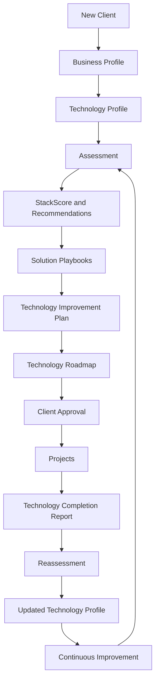
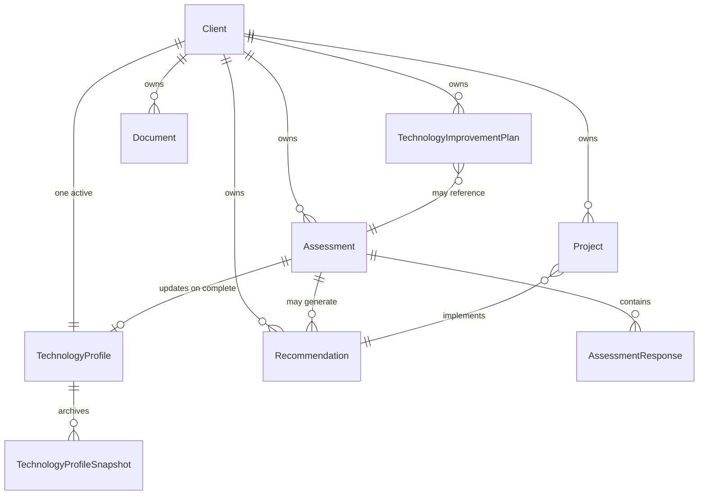
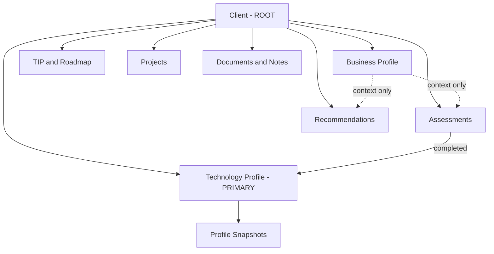
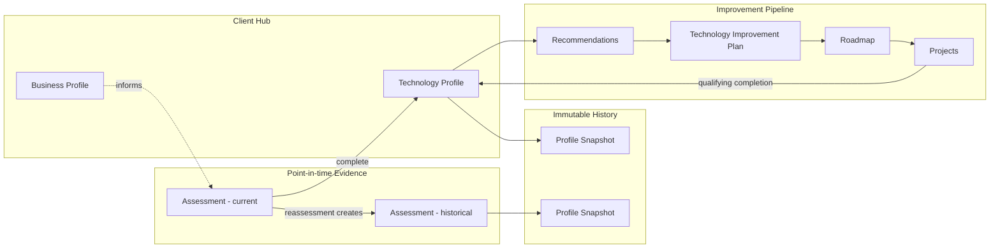
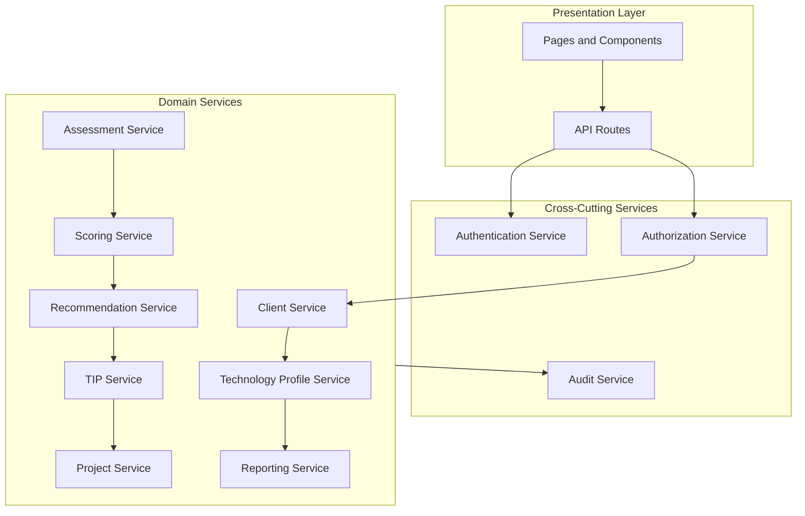
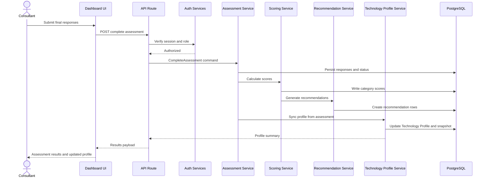
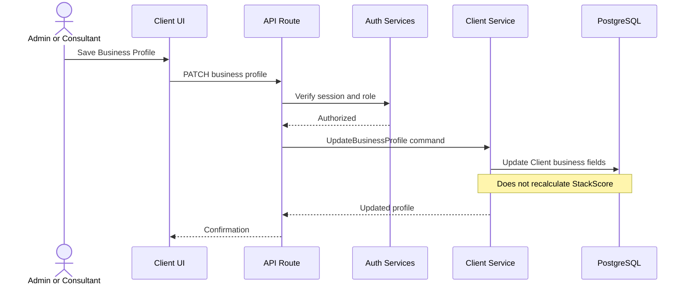
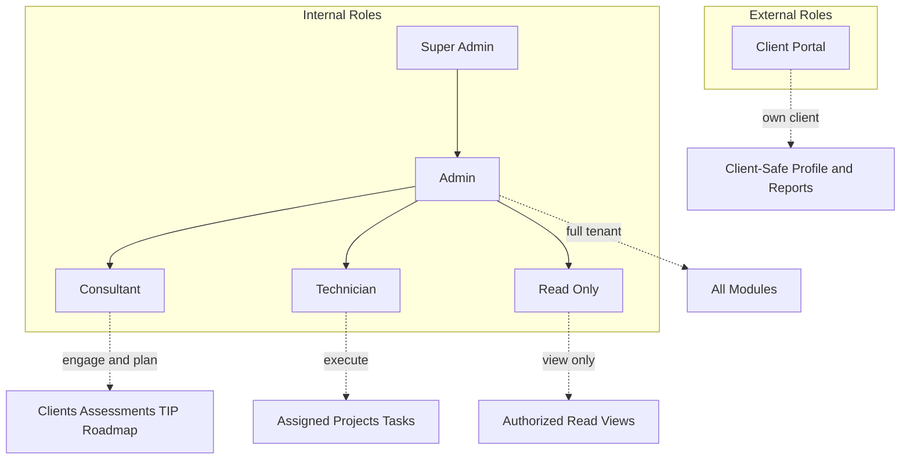

# DOC-130 – Architecture Diagrams Specification

**Document ID:** DOC-130
**Version:** 1.0
**Status:** Draft
**Owner:** BobKat IT
**Last Updated:** June 26, 2026

---

# 1. Purpose

DOC-130 defines the **standard architecture diagrams** used to explain how StackScore works from a business, domain, workflow, service, and data-flow perspective.

These diagrams are the canonical visual companion to:

* [DOC-108 – Business Profile Specification](../10-Product/DOC-108%20%E2%80%93%20Business%20Profile%20Specification.md) — lightweight business context
* [DOC-113 – Technology Profile Specification](../20-Business-Logic/DOC-113%20%E2%80%93%20Technology%20Profile%20Specification.md) — client technology health record
* [DOC-120 – Domain Model Specification](DOC-120%20%E2%80%93%20Domain%20Model%20Specification.md) — core business objects
* [DOC-121 – Database Schema Specification](DOC-121%20%E2%80%93%20Database%20Schema%20Specification.md) — persistence model
* [DOC-123 – Application Workflow Specification](DOC-123%20%E2%80%93%20Application%20Workflow%20Specification.md) — user workflows
* [DOC-124 – Service Layer Specification](DOC-124%20%E2%80%93%20Service%20Layer%20Specification.md) — business services
* [DOC-129 – AI Development Rules & Engineering Constitution](DOC-129%20%E2%80%93%20AI%20Development%20Rules%20&%20Engineering%20Constitution.md) — documentation-driven development

DOC-130 is a **visual architecture specification only**. It does not define implementation code.

---

# 2. Diagram Philosophy

* **Explain, do not overwhelm** — each diagram answers one question clearly.
* **Prefer Mermaid in Markdown** — diagrams live in this document and may be embedded in other approved specs.
* **Stay aligned with governing specs** — if a diagram conflicts with DOC-120, DOC-123, or DOC-124, the governing spec wins until DOC-130 is revised.
* **Update on major change** — new domain objects, workflow stages, services, or role boundaries require a diagram review.
* **Label v1 vs v2 when needed** — note intentional divergence per [DOC-118 – v1 to v2 Compatibility Reference](../20-Business-Logic/DOC-118%20%E2%80%93%20v1%20to%20v2%20Compatibility%20Reference.md).

---

# 3. Maintenance Rules

| Trigger | Action |
| ------- | ------ |
| New client hub object (e.g. Business Profile field group) | Update Diagrams 2, 3, and 5 |
| New BTIL / workflow stage | Update Diagram 1 |
| New core service in DOC-124 | Update Diagrams 4 and 5 |
| Role or permission change in DOC-122 | Update Diagram 6 |
| Database anchor change in DOC-121 | Update Diagrams 2 and 3 |

**Revision process:** increment DOC-130 version, update **Last Updated**, and add a row to **Revision History** (Section 10).

---

# 4. Diagram 1 — Application Lifecycle

**Question answered:** What is the standard client journey through StackScore?

**Source:** [DOC-003 – BTIL](../00-Governance/DOC-003%20-%20Bobkat%20Technology%20Improvement%20Lifecycle%20%28BTIL%29.md).md), [DOC-123 – Application Workflow](DOC-123%20%E2%80%93%20Application%20Workflow%20Specification.md)

Business context is captured early; technology health and improvement drive the lifecycle. The **Technology Profile** is the hub for all improvement activity.

**Notes:**

* [DOC-108](../10-Product/DOC-108%20%E2%80%93%20Business%20Profile%20Specification.md) provides context only — it does not change StackScore calculations.
* Every completed assessment and qualifying project feeds back into the Technology Profile per [DOC-113](../20-Business-Logic/DOC-113%20%E2%80%93%20Technology%20Profile%20Specification.md).

---

# 5. Diagram 2 — Domain Model

**Question answered:** What are the core business objects and how do they relate?

**Source:** [DOC-120 – Domain Model](DOC-120%20%E2%80%93%20Domain%20Model%20Specification.md), [DOC-121 – Database Schema](DOC-121%20%E2%80%93%20Database%20Schema%20Specification.md)

**Client hub (simplified):**

**Notes:**

* **Client** is the root aggregate ([DOC-120](DOC-120%20%E2%80%93%20Domain%20Model%20Specification.md)).
* **Business Profile** ([DOC-108](../10-Product/DOC-108%20%E2%80%93%20Business%20Profile%20Specification.md)) is lightweight context on the client record — not a CRM.
* **Catalog objects** (services, playbooks, question library) are shared reference data and omitted here for clarity.

---

# 6. Diagram 3 — Technology Profile Relationship Model

**Question answered:** How does the Technology Profile relate to assessments, history, and planning artifacts?

**Source:** [DOC-113 – Technology Profile](../20-Business-Logic/DOC-113%20%E2%80%93%20Technology%20Profile%20Specification.md), [DOC-121 – Database Schema](DOC-121%20%E2%80%93%20Database%20Schema%20Specification.md)

**Rules (from DOC-113):**

* Exactly **one active** Technology Profile per client.
* **Snapshots** preserve history; past snapshots are never mutated.
* Scores change only through **completed assessments** or **verified qualifying work** — never manual edits.
* Business Profile data **does not** directly alter StackScore.

---

# 7. Diagram 4 — Service Layer

**Question answered:** How is business logic organized in the application?

**Source:** [DOC-124 – Service Layer](DOC-124%20%E2%80%93%20Service%20Layer%20Specification.md), [DOC-129 – Engineering Constitution](DOC-129%20%E2%80%93%20AI%20Development%20Rules%20&%20Engineering%20Constitution.md)

**Boundary rules ([DOC-124](DOC-124%20%E2%80%93%20Service%20Layer%20Specification.md)):**

* UI and API are **thin** — authenticate, authorize, validate shape, delegate.
* Services own **business rules** and lifecycle transitions.
* **Technology Profile Service** is the read hub for client technology health.

**v1 note:** Some logic still lives in API routes during migration; new work follows service boundaries per [DOC-129](DOC-129%20%E2%80%93%20AI%20Development%20Rules%20&%20Engineering%20Constitution.md).

---

# 8. Diagram 5 — Data Flow

**Question answered:** How does a typical user action move through the system?

**Source:** [DOC-123 – Application Workflow](DOC-123%20%E2%80%93%20Application%20Workflow%20Specification.md), [DOC-124 – Service Layer](DOC-124%20%E2%80%93%20Service%20Layer%20Specification.md), [DOC-121 – Database Schema](DOC-121%20%E2%80%93%20Database%20Schema%20Specification.md)

**Example: Complete an assessment**

**Example: Edit Business Profile**

---

# 9. Diagram 6 — User Role Access Overview

**Question answered:** Who can access what at a high level?

**Source:** [DOC-122 – Roles & Permissions](DOC-122%20%E2%80%93%20Roles%20&%20Permissions%20Specification.md)

**v2 target roles:**

**Module access summary (simplified):**

| Module | Admin | Consultant | Technician | Client |
| ------ | ----- | ---------- | ---------- | ------ |
| Business Profile | Edit | Edit | View limited | View future |
| Technology Profile | Full | Full | View limited | Summary future |
| Assessments | Full | Full | Participate | — |
| Recommendations | Full | Full | View assigned | — |
| TIP / Roadmap | Full | Full | — | Approved view future |
| Pricing / Playbooks | Full | Delegated | — | — |
| Projects | Full | Full | Assigned | Status future |
| Admin / Catalog | Full | — | — | — |

**v1 implementation note ([DOC-122](DOC-122%20%E2%80%93%20Roles%20&%20Permissions%20Specification.md)):** MVP exposes `admin` and `technician` only. `admin` maps to **Admin**; `technician` maps to combined **Consultant + Technician** capabilities until the role split ships.

---

# 10. Related Documents

* [DOC-000 – Documentation Architecture & Index](../DOC-000%20%E2%80%93%20Documentation%20Architecture%20&%20Index.md)
* [DOC-108 – Business Profile Specification](../10-Product/DOC-108%20%E2%80%93%20Business%20Profile%20Specification.md)
* [DOC-113 – Technology Profile Specification](../20-Business-Logic/DOC-113%20%E2%80%93%20Technology%20Profile%20Specification.md)
* [DOC-118 – v1 to v2 Compatibility Reference](../20-Business-Logic/DOC-118%20%E2%80%93%20v1%20to%20v2%20Compatibility%20Reference.md)
* [DOC-120 – Domain Model Specification](DOC-120%20%E2%80%93%20Domain%20Model%20Specification.md)
* [DOC-121 – Database Schema Specification](DOC-121%20%E2%80%93%20Database%20Schema%20Specification.md)
* [DOC-122 – Roles & Permissions Specification](DOC-122%20%E2%80%93%20Roles%20&%20Permissions%20Specification.md)
* [DOC-123 – Application Workflow Specification](DOC-123%20%E2%80%93%20Application%20Workflow%20Specification.md)
* [DOC-124 – Service Layer Specification](DOC-124%20%E2%80%93%20Service%20Layer%20Specification.md)
* [DOC-129 – AI Development Rules & Engineering Constitution](DOC-129%20%E2%80%93%20AI%20Development%20Rules%20&%20Engineering%20Constitution.md)

---

# 11. Revision History

| Version | Date | Author | Changes |
| ------- | ---- | ------ | ------- |
| 1.0 | 2026-06-26 | BobKat IT | Initial architecture diagrams specification |
