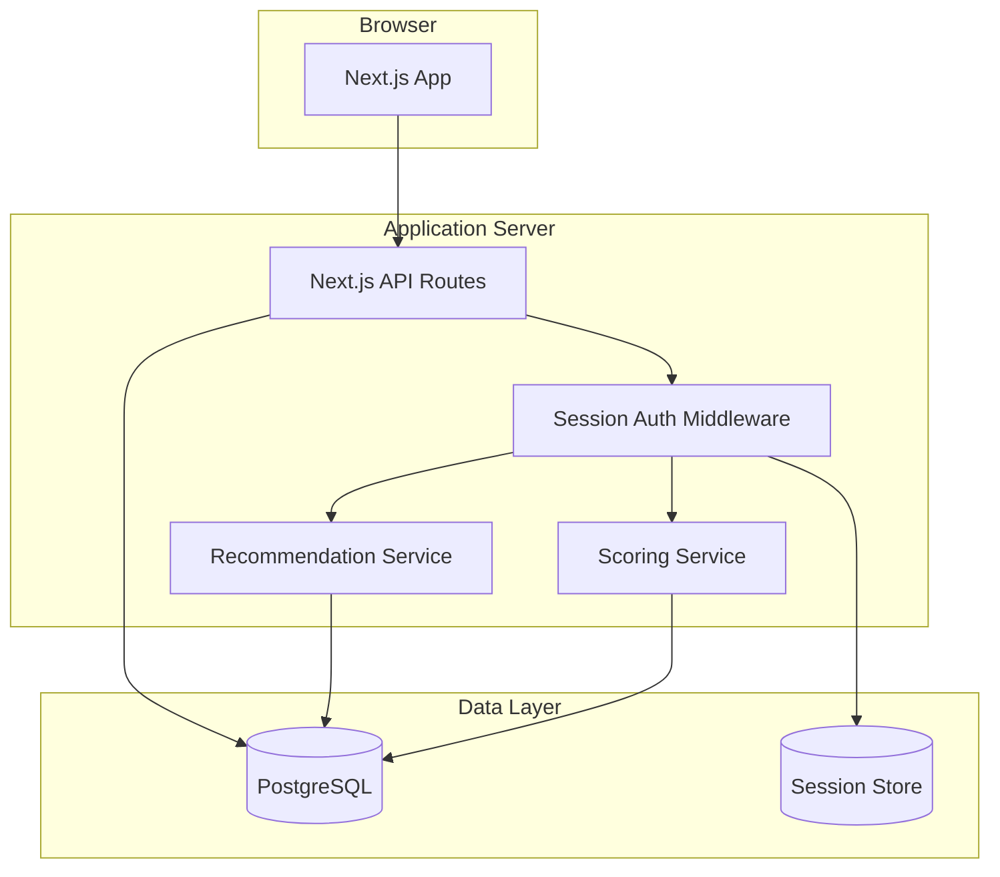
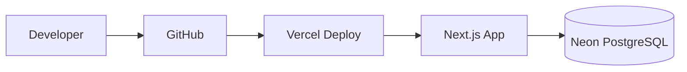

# BobKat StackScore - Technical Architecture

# Architectural Principles

The software architecture shall implement the business architecture defined in:

- [DOC-001 – Product Vision](DOC-001%20-%20Product%20Vision.md)
- [DOC-002 – Product Philosophy](DOC-002-Product%20Philosophy.md)
- [DOC-003 – BobKat Technology Improvement Lifecycle (BTIL)](DOC-003%20-%20Bobkat%20Technology%20Improvement%20Lifecycle%20%28BTIL%29.md)
- [DOC-004 – Design Principles](DOC-004%20%E2%80%93%20Design%20Principles.md)
- [DOC-005 – UI & UX Standards](DOC-005%20%E2%80%93%20UI%20&%20UX%20Standards.md)

If technical implementation conflicts with business architecture, the governing business documents take precedence until updated.

## Purpose

This document defines the technology stack, application architecture, deployment model, and API boundaries for BobKat StackScore MVP.

**Related documents:** [MVP_PRD.md](MVP_PRD.md), [DOC-301 – Database Schema Specification](DOC-301%20%E2%80%93%20Database%20Schema%20Specification.md), [DOC-303 – RBAC & Security Specification](DOC-303%20RBAC%20&%20Security%20Specification.md), [DOC-302 – API Specification](DOC-302%20-%20API%20Specification.md), [DOC-000 – Documentation Architecture & Index](DOC-000%20%E2%80%93%20Documentation%20Architecture%20&%20Index.md)

---

## Architecture Overview



BobKat StackScore MVP is a **monolithic full-stack web application** with a clear service layer inside the codebase. Microservices are not warranted at this scale.

---

## Technology Stack

| Layer | Technology | Rationale |
| ----- | ---------- | --------- |
| Language | TypeScript | Type safety across frontend and backend |
| Framework | Next.js 14+ (App Router) | Full-stack React with API routes; fast MVP delivery |
| UI | React + Tailwind CSS + shadcn/ui | Consistent, accessible component library |
| Database | PostgreSQL 15+ | Relational model matches domain; strong JSON support if needed |
| ORM | Prisma | Schema-first; migrations; type-safe queries |
| Auth | Auth.js v5 (NextAuth) credentials provider with JWT session strategy | Implemented; HTTP-only secure cookie signed with `AUTH_SECRET`; SSO in Phase 2 |
| Validation | Zod | Shared schemas between API and forms |
| Charts | Recharts | Score trend visualization |
| Testing | Vitest + Playwright | Unit tests for scoring; E2E for assessment flow |
| Hosting | Vercel (app) + Neon or Supabase (database) | Low ops overhead for MVP |

### Alternatives considered

| Option | Why not MVP |
| ------ | ----------- |
| Separate Express API | Extra deployment complexity without benefit at this scale |
| MongoDB | Relational scoring model fits SQL better |
| Python/Django | Team velocity higher with TypeScript full-stack |

---

## Project Structure

```text
bobkat-stackscore/
├── prisma/
│   ├── schema.prisma          # Database schema
│   ├── seed.ts                # Categories, questions, answers, templates
│   └── migrations/
├── src/
│   ├── app/                   # Next.js App Router pages
│   │   ├── (auth)/            # Login
│   │   ├── (dashboard)/       # Authenticated layout
│   │   │   ├── clients/
│   │   │   ├── assessments/
│   │   │   ├── projects/
│   │   │   └── admin/
│   │   └── api/               # API route handlers
│   ├── components/            # React components
│   ├── lib/
│   │   ├── auth/              # Session, password hashing
│   │   ├── db/                # Prisma client
│   │   ├── scoring/           # Score calculation engine
│   │   ├── recommendations/   # Recommendation generation
│   │   └── validators/        # Zod schemas
│   └── types/                 # Shared TypeScript types
├── docs/                      # Documentation
├── data/
│   └── RecommendationRuleCatalog.json
└── tests/
    ├── scoring/
    └── e2e/
```

---

## Core Services

### Scoring Service (`lib/scoring/`)

**Responsibility:** Calculate category scores, overall score, rating, critical exposure flag.

**Input:** Assessment ID with all responses.

**Output:**
```typescript
{
  categoryScores: CategoryScoreResult[];
  overallScore: number;
  overallRating: Rating;
  hasCriticalExposure: boolean;
}
```

**Rules source:** [DOC-111A – Scoring Engine Specification](DOC-111A%20-%20Scoring%20Engine%20Specification.md), [DOC-115 – Question Scoring Matrix](DOC-115%20-%20Question%20Scoring%20Matrix.md)

**Key functions:**
- `calculateCategoryScore(responses, questions)`
- `calculateOverallScore(categoryScores)`
- `evaluateCriticalFlags(responses, answerOptions)`
- `getRating(score: number)`

### Recommendation Service (`lib/recommendations/`)

**Responsibility:** Generate, consolidate, and deduplicate recommendations on assessment completion.

**Rules source:** [RecommendationRuleCatalog.json](RecommendationRuleCatalog.json)

**Key functions:**
- `evaluateTriggers(responses, catalog)`
- `applyConsolidation(triggeredTemplates, groups)`
- `calculateProjectedScore(currentScore, recommendations)`

### Assessment Service (`lib/assessments/`)

**Responsibility:** Orchestrate draft save, completion transaction, score history write.

**Completion transaction:**
1. Validate all questions answered
2. Call Scoring Service
3. Write Assessment Category Scores + denormalized Assessments fields
4. Call Recommendation Service
5. Write Assessment Recommendations
6. Generate executive summary
7. Write Client Score History
8. Set status = completed

---

## Database

### Schema source

[DOC-301 – Database Schema Specification](DOC-301%20%E2%80%93%20Database%20Schema%20Specification.md) is implemented in `prisma/schema.prisma`.

### MVP schema additions

| Addition | Purpose |
| -------- | ------- |
| `Assessments.hasCriticalExposure` | Boolean for critical flag warning |

### Seed data

Loaded from:
- Categories: fixed 7 categories from DOC-301 – Database Schema Specification
- Questions + Answer Options: [DOC-115 – Question Scoring Matrix](DOC-115%20-%20Question%20Scoring%20Matrix.md)
- Recommendation Templates: [RecommendationRuleCatalog.json](RecommendationRuleCatalog.json)

### Migrations

- Prisma migrate for all schema changes
- Seed script idempotent (upsert by question code)

---

## API Design

REST-style JSON API via Next.js Route Handlers. Full endpoint list in [DOC-302 – API Specification](DOC-302%20-%20API%20Specification.md).

### API conventions

| Convention | Value |
| ---------- | ----- |
| Base path | `/api/v1` |
| Auth | Session cookie |
| Errors | `{ error: string, code: string }` |
| Pagination | `?page=1&limit=20` |
| Sorting | `?sort=createdAt&order=desc` |

### Core resource endpoints

| Resource | Endpoints |
| -------- | --------- |
| Auth | `POST /auth/login`, `POST /auth/logout`, `GET /auth/me` |
| Users | `GET/POST /users`, `PATCH /users/:id` |
| Clients | `GET/POST /clients`, `GET/PATCH /clients/:id` |
| Assessments | `GET/POST /clients/:clientId/assessments`, `GET/PATCH /assessments/:id` |
| Responses | `PUT /assessments/:id/responses/:questionId` |
| Complete | `POST /assessments/:id/complete` |
| Recommendations | `GET /assessments/:id/recommendations`, `PATCH /recommendations/:id` |
| Projects | `GET/POST /clients/:clientId/projects`, `PATCH /projects/:id` |
| Score history | `GET /clients/:clientId/score-history` |

---

## Frontend Architecture

### Page structure

| Route | Purpose |
| ----- | ------- |
| `/login` | Authentication |
| `/dashboard` | Admin overview |
| `/clients` | Client list |
| `/clients/[id]` | Client detail + score trend |
| `/clients/[id]/assessments/new` | Start assessment |
| `/assessments/[id]` | Assessment wizard (draft) |
| `/assessments/[id]/results` | Completed results view |
| `/projects` | Project list |
| `/admin/users` | User management |

### State management

- Server Components for data fetching where possible
- React Hook Form for assessment question forms
- Optimistic UI for answer saves
- SWR or React Query for client-side cache of assessment progress

### Assessment wizard UX

- Category tabs or stepper (7 steps)
- Progress indicator (questions answered / 50)
- Auto-save on answer selection
- Live score preview sidebar (draft only)

---

## Environments

| Environment | Purpose | Database |
| ----------- | ------- | -------- |
| local | Development | Local PostgreSQL or Docker |
| staging | Pre-production testing | Neon branch |
| production | Live internal use | Neon production |

### Environment variables

```text
DATABASE_URL=
SESSION_SECRET=
NODE_ENV=
NEXT_PUBLIC_APP_URL=
```

---

## Deployment

### MVP deployment model



| Step | Action |
| ---- | ------ |
| 1 | Push to `main` triggers Vercel production deploy |
| 2 | Push to `develop` triggers staging deploy |
| 3 | Prisma migrate runs in CI before deploy |
| 4 | Seed runs manually on first deploy only |

### CI pipeline (GitHub Actions)

1. Lint (ESLint)
2. Type check (`tsc --noEmit`)
3. Unit tests (scoring, recommendations)
4. Prisma migrate diff check
5. Deploy to Vercel (on merge)

---

## Background Jobs

No background job processor in MVP. All operations are synchronous:

- Assessment completion (scoring + recommendations) runs in the complete API request
- Expected completion time < 2 seconds

**Phase 2:** PDF generation and email notifications will require a job queue (e.g., Inngest or BullMQ).

---

## File Storage

Documents table exists in schema but is **not implemented in MVP**.

Phase 2 will use S3-compatible storage (AWS S3 or Cloudflare R2) with presigned URLs.

---

## Integration Boundaries (Future)

| Integration | Interface | Phase |
| ----------- | --------- | ----- |
| Microsoft 365 | Graph API read-only | Phase 3 |
| NinjaOne | REST API asset sync | Phase 3 |
| Ubiquiti | UniFi API network data | Phase 3 |

MVP architecture keeps an `IntegrationService` interface stub:

```typescript
interface IntegrationProvider {
  name: string;
  fetchAssets(clientId: string): Promise<ExternalAsset[]>;
  // Not implemented in MVP
}
```

---

## Error Handling

| Layer | Strategy |
| ----- | -------- |
| API | Try/catch with structured error responses; log server errors |
| Scoring | Validate inputs; throw `ScoringError` with code |
| Database | Prisma error mapping to HTTP status |
| Frontend | Toast notifications for user-facing errors |

---

## Performance Considerations

| Concern | Approach |
| ------- | -------- |
| Assessment with 50 questions | Batch load questions + existing responses in one query |
| Score calculation | In-memory; < 50ms |
| Recommendation generation | Load catalog from JSON at startup; cache in memory |
| Client list | Paginated; index on `companyName`, `status` |
| Score history chart | Index on `clientId`, `recordedDate` |

---

## Monitoring (MVP minimal)

| Tool | Purpose |
| ---- | ------- |
| Vercel Analytics | Page performance |
| Vercel Logs | Application errors |
| Neon dashboard | Database metrics |

Structured logging with request ID for traceability. Full APM (e.g., Sentry) recommended before production launch.

---

## Development Phases

| Phase | Deliverable |
| ----- | ----------- |
| 1 | Project scaffold, Prisma schema, seed data, auth |
| 2 | Client CRUD, assessment wizard, draft save |
| 3 | Scoring engine, completion flow, results view |
| 4 | Recommendation engine, projects |
| 5 | Score history, comparison, admin dashboard |
| 6 | Polish, E2E tests, staging deploy |

---

## Implementation Checklist

- [ ] Initialize Next.js + TypeScript + Tailwind + Prisma
- [ ] Implement schema from DOC-301 – Database Schema Specification
- [ ] Seed script from DOC-115 – Question Scoring Matrix + RecommendationRuleCatalog
- [ ] Session auth per DOC-303 – RBAC & Security Specification
- [ ] Scoring service with unit tests matching DOC-111A – Scoring Engine Specification examples
- [ ] Recommendation service with consolidation tests
- [ ] API routes per DOC-302 – API Specification
- [ ] Assessment wizard UI
- [ ] Results/report view
- [ ] Deploy to Vercel + Neon
