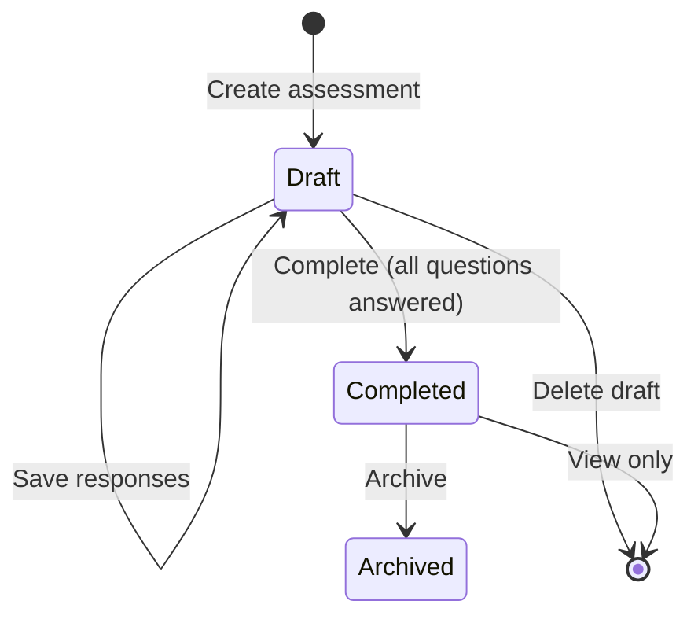

# BobKat StackScore - MVP Product Requirements (PRD)

## Document Information

| Field | Value |
| ----- | ----- |
| Version | 1.0 |
| Status | Approved for development |
| Target users | BobKat IT internal staff (admin, technician) |

---

## Executive Summary

BobKat StackScore MVP is an **internal assessment tool** that enables BobKat IT staff to evaluate client technology environments, calculate maturity scores, generate prioritized recommendations, and track improvement projects over time.

MVP delivers the core assessor workflow end-to-end. Client self-service portal and third-party integrations remain deferred. **PDF assessment report export is in scope** per [DOC-005 – UI & UX Standards](DOC-005%20%E2%80%93%20UI%20&%20UX%20Standards.md) (implemented).

---

## Problem Statement

BobKat IT needs a standardized way to:

1. Assess client technology maturity during sales and ongoing engagements
2. Communicate risk in business terms (not technical jargon)
3. Prioritize remediation efforts aligned with BobKat service offerings
4. Demonstrate measurable improvement across repeat assessments

Today this process is inconsistent and difficult to track over time.

---

## Goals and Success Metrics

### Goals

- Complete a full client assessment in under 60 minutes
- Produce a consistent StackScore (0–100) with category breakdown
- Auto-generate prioritized recommendations from assessment answers
- Track score trends across multiple assessments per client

### Success Metrics (90 days post-launch)

| Metric | Target |
| ------ | ------ |
| Assessments completed | ≥ 20 |
| Average assessment completion time | < 60 minutes |
| Assessor satisfaction (internal survey) | ≥ 4/5 |
| Recommendations generated per assessment | ≥ 3 (average) |
| Clients with 2+ assessments | ≥ 5 |

---

## Personas

### P1 — Assessor (Technician)

**Who:** BobKat technician conducting on-site or remote client assessments.

**Needs:**
- Guided question flow by category
- Save progress and resume later
- Add notes and evidence per question
- Review scores and recommendations before presenting to client

**Pain points:** Manual spreadsheets, inconsistent scoring, no historical comparison.

### P2 — Account Manager / vCIO

**Who:** BobKat staff presenting assessment results to client leadership.

**Needs:**
- Executive summary with business-friendly language
- Top risks and projected improvement score
- Link recommendations to projects and proposals

**Pain points:** Technical reports that clients don't understand.

### P3 — Admin

**Who:** BobKat IT operations lead managing the platform.

**Needs:**
- User management (create/disable staff accounts)
- Client records management
- View all assessments and trends across clients

**Pain points:** No centralized view of assessment activity.

---

## User Stories

### Client Management

| ID | Story | Priority |
| -- | ----- | -------- |
| CM-01 | As an assessor, I can create a client record with company name, contact info, industry, and employee count so I can begin an assessment. | Must |
| CM-02 | As an assessor, I can search and filter clients by name and status (prospect, active, inactive). | Must |
| CM-03 | As an assessor, I can view a client detail page showing assessment history and score trends. | Must |
| CM-04 | As an admin, I can edit and deactivate client records. | Must |

### Assessment Workflow

| ID | Story | Priority |
| -- | ----- | -------- |
| AW-01 | As an assessor, I can start a new assessment for a client with a name, type (initial, quarterly, annual, followup), and date. | Must |
| AW-02 | As an assessor, I can answer all 50 questions organized by category with save-as-draft at any point. | Must |
| AW-03 | As an assessor, I can add notes and evidence text to any question response. | Should |
| AW-04 | As an assessor, I can see a live score preview while completing a draft assessment. | Should |
| AW-05 | As an assessor, I cannot complete an assessment until all active questions are answered. | Must |
| AW-06 | As an assessor, I can complete an assessment to lock scores and generate recommendations. | Must |
| AW-07 | As an assessor, I can edit the auto-generated executive summary before finalizing. | Must |
| AW-08 | As an assessor, I can add internal notes visible only to BobKat staff. | Must |
| AW-09 | As an assessor, I can compare two completed assessments for the same client side-by-side. | Should |
| AW-10 | As an assessor, I cannot edit responses on a completed assessment (must create a new assessment). | Must |

### Scoring and Results

| ID | Story | Priority |
| -- | ----- | -------- |
| SR-01 | As an assessor, I can view overall StackScore (0–100) with rating label after completion. | Must |
| SR-02 | As an assessor, I can view per-category scores with earned/possible points and percentage. | Must |
| SR-03 | As an assessor, I can see a Critical Exposure Warning when critical flags are triggered. | Must |
| SR-04 | As an assessor, I can view projected score based on open recommendations. | Should |

### Recommendations

| ID | Story | Priority |
| -- | ----- | -------- |
| RC-01 | As an assessor, recommendations are auto-generated when I complete an assessment. | Must |
| RC-02 | As an assessor, I can view recommendations sorted by priority with business impact and suggested service. | Must |
| RC-03 | As an assessor, I can change recommendation status (open, accepted, declined, completed). | Must |
| RC-04 | As an assessor, I can manually add a custom recommendation to an assessment. | Should |
| RC-05 | As an assessor, consolidated recommendations replace individual duplicates per consolidation rules. | Must |

### Projects

| ID | Story | Priority |
| -- | ----- | -------- |
| PJ-01 | As an assessor, I can create a project from a recommendation. | Must |
| PJ-02 | As an assessor, I can assign a project to a BobKat user with status and target date. | Must |
| PJ-03 | As an assessor, I can track project status through proposed → approved → in_progress → completed. | Must |
| PJ-04 | As an assessor, completing a project marks the linked recommendation as completed. | Must |

### Administration

| ID | Story | Priority |
| -- | ----- | -------- |
| AD-01 | As an admin, I can create and disable user accounts with role assignment. | Must |
| AD-02 | As an admin, I can view a dashboard of recent assessments and clients at risk (score < 60). | Should |

---

## Assessment Workflow Specification

### Create

1. Assessor selects client
2. Enters assessment name, type, and date
3. System creates assessment in `draft` status
4. All active questions loaded in category order

### Draft

- Assessor answers questions one category at a time
- Responses saved on each answer (auto-save) or explicit save
- Live score preview available (not persisted to score history)
- Assessor may exit and resume later

### Complete

**Preconditions:**
- All 50 active questions have responses
- Assessor user assigned

**Actions (atomic transaction):**
1. Calculate category scores → write `Assessment Category Scores`
2. Calculate overall score and rating → write `Assessments` denormalized fields
3. Evaluate critical flags → set `hasCriticalExposure`
4. Generate recommendations from [RecommendationRuleCatalog.json](RecommendationRuleCatalog.json)
5. Apply consolidation rules
6. Generate draft executive summary
7. Write `Client Score History` snapshot
8. Set status to `completed` and `completedAt` timestamp

### Post-Complete

- Responses are read-only
- Assessor may edit `executiveSummary` and `internalNotes`
- To change answers, create a new assessment (e.g., quarterly review)

### Archive

- Admin or assessor may archive old assessments
- Archived assessments remain viewable but cannot be edited

---

## Report Deliverables (MVP)

### Web Report (in-app)

The primary MVP deliverable is an **in-app assessment results view** containing:

| Section | Content |
| ------- | ------- |
| Header | Client name, assessment name, date, assessor |
| Overall score | Score / 100, rating label, critical exposure warning |
| Category breakdown | 7 categories with percent, rating, progress bar |
| Top strengths | 2 highest-scoring categories |
| Top risks | 2 lowest-scoring categories |
| Recommendations | Prioritized list with business impact and suggested service |
| Projected score | Current + estimated improvement (capped at 100) |
| Executive summary | Editable narrative block |

### Out of scope for MVP

- PDF export
- Email delivery
- Client-branded templates
- Print layout

---

## In Scope (MVP)

- User authentication (email/password) for BobKat staff
- Role-based access (admin, technician)
- Client CRUD
- Full 50-question assessment workflow (draft → complete)
- Scoring per [DOC-111A – Scoring Engine Specification](DOC-111A%20-%20Scoring%20Engine%20Specification.md)
- Auto-recommendation generation per [RecommendationRuleCatalog.json](RecommendationRuleCatalog.json)
- Recommendation status management
- Project creation and tracking from recommendations
- Client score history and trend chart (overall + categories)
- Assessment comparison (two assessments)
- Executive summary (auto-generated, editable)
- Internal notes on assessments

---

## Out of Scope (MVP)

| Feature | Target phase |
| ------- | ------------ |
| Client portal (client role login) | Phase 2 |
| PDF / print report export | **In scope (MVP)** — see DOC-005 Reports & PDF Exports |
| Documents upload and storage | Phase 2 |
| Activity log / notes timeline | Phase 2 |
| Microsoft 365 integration | Phase 3 |
| NinjaOne / Ubiquiti integration | Phase 3 |
| Automated asset discovery | Phase 3 |
| AI-generated executive summaries | Phase 3 |
| Proposal generation | Phase 3 |
| Industry-specific weighting | Phase 3 |
| Email notifications | Phase 2 |
| SSO / Azure AD login | Phase 2 |
| Mobile-native app | Not planned |

---

## Non-Functional Requirements

| Requirement | Target |
| ----------- | ------ |
| Page load time | < 2 seconds on broadband |
| Concurrent users | 10 (MVP) |
| Data retention | Indefinite |
| Availability | Best effort (business hours) |
| Browser support | Latest Chrome, Edge, Firefox |
| Authentication | Secure password hashing (bcrypt or argon2) |
| HTTPS | Required in production |

---

## Dependencies

| Dependency | Document |
| ---------- | -------- |
| Question weights and scores | [DOC-115 – Question Scoring Matrix](DOC-115%20-%20Question%20Scoring%20Matrix.md) |
| Scoring rules | [DOC-111A – Scoring Engine Specification](DOC-111A%20-%20Scoring%20Engine%20Specification.md) |
| Recommendation rules | [RecommendationRuleCatalog.json](RecommendationRuleCatalog.json) |
| Data model | [DOC-301 – Database Schema Specification](DOC-301%20%E2%80%93%20Database%20Schema%20Specification.md) |
| RBAC | [DOC-303 – RBAC & Security Specification](DOC-303%20RBAC%20&%20Security%20Specification.md) |
| Architecture | [DOC-300 – Technical Architecture](DOC-300%20-%20Technical%20Architecture.md) |

---

## Open Questions (Resolved for MVP)

| Question | Decision |
| -------- | -------- |
| Who runs assessments? | BobKat staff only |
| Client self-assessment? | No (Phase 2 portal) |
| Edit completed assessments? | No — create new assessment |
| PDF reports? | **Yes** — assessment PDF export (MVP) |
| Which roles in MVP? | admin, technician (client role dormant) |

---

## Release Criteria

MVP is ready for internal use when:

1. All Must-have user stories are implemented
2. Scoring matches worked examples in DOC-111A – Scoring Engine Specification
3. All 50 questions seed correctly with answer options
4. Recommendation generation matches catalog triggers
5. At least one end-to-end test assessment completes successfully
6. Admin can manage users; technician can complete full workflow
